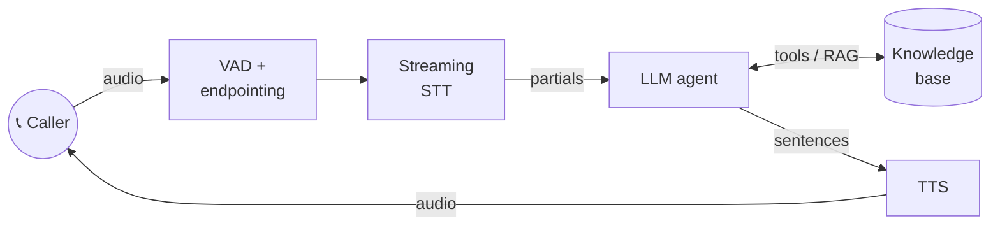

```mermaid
gantt
    title One caller turn, before and after
    dateFormat x
    axisFormat %-S.%L s
    section Sequential
    endpointing           : 0, 310
    STT final             : 310, 790
    LLM first token       : 790, 1650
    TTS first audio       : 1650, 2310
    section Streamed
    endpointing           : 0, 310
    STT final (partials)  : 310, 430
    LLM (speculative)     : 200, 760
    TTS (first sentence)  : 760, 1040
```

<div align="center">
  <a href="https://atharva-3de.pages.dev/">
    
  </a>
</div>

<a name="desktop"></a>

<p align="center">
  <a href="#win-about"></a>
  <a href="#win-projects"></a>
  <a href="#win-oncall"></a>
  <a href="#win-htop"></a>
  <a href="#win-logs"></a>
  <a href="#win-mail"></a>
  <a href="#win-trash"></a>
</p>

<p align="center"><sub>Click an icon to open its window.</sub></p>

<a name="win-about"></a>


```python
class Atharva(Engineer):
    role     = "AI / ML / GenAI Engineer"
    company  = "CFOLogic"
    focus    = ["speech pipelines", "LLM systems", "agents", "interpretable ML"]
    speaks   = ["python", "c++", "java"]
    motto    = "most of what I build listens for a while before it decides anything"

    def previously(self):
        return {
            "Emitrr":   "cut transcription latency on a live voice pipeline by 30%, "
                        "rebuilt the TTS path, built an agent that recovers failing calls",
            "Research": "non-invasive blood glucose estimation (published)",
        }

    def off_hours(self):
        return "small experiments that poke at the edges of these systems"
```


<a href="#desktop"></a>


<a name="win-projects"></a>


```console
atharva@wittyos:~$ ls -l projects/ --sort=interesting
```

| Permissions | Name | Modified | What it does |
|---|---|---|---|
| `drwxr-xr-x` | 📁 [guardtheweights/](https://github.com/wittyicon29/guardtheweights) | 2026‑02‑28 | Adversarial LLM game: get a cryptic narrator to give up its secrets |
| `drwxr-xr-x` | 📁 [PWC-RAG/](https://github.com/wittyicon29/PWC-RAG) | 2024‑03‑08 | RAG search over recent ML research |
| `drwxr-xr-x` | 📁 [RAG-over-Audio-Data/](https://github.com/wittyicon29/RAG-over-Audio-Data) | 2023‑12‑17 | Ask questions about hours of audio |
| `drwxr-xr-x` | 📁 [Agentic-RAG-Customer-Support/](https://github.com/wittyicon29/Agentic-RAG-Customer-Support) | 2025‑03‑02 | Support agent with KB and search tools |
| `drwxr-xr-x` | 📁 [Stutter_Detection/](https://github.com/wittyicon29/Stutter_Detection) | 2023‑12‑24 | Wav2vec-based stutter detection |
| `drwxr-xr-x` | 📁 [WeedWatch/](https://github.com/wittyicon29/WeedWatch-Weed-Detection-using-CNN) | 2024‑03‑26 | CNN weed detection, most-starred ⭐ |
| `drwxr-xr-x` | 📁 [AstoGemma/](https://github.com/wittyicon29/AstoGemma) | 2024‑02‑27 | Local chat UI for any Ollama model |
| `drwxr-xr-x` | 📁 [In-Memory-DB/](https://github.com/wittyicon29/In-Memory-DB) | 2024‑12‑21 | A small RAM-first database in C++ |

<sub>8 directories shown. [66 more →](https://github.com/wittyicon29?tab=repositories)</sub>


<a href="#desktop"></a>


<a name="win-oncall"></a>


It's **3:12 AM** and this pipeline is blowing its latency SLO. Callers are talking over the bot. Can you fix it before stand-up?



Every choice is a link that jumps to the next scene. There's nothing to install: just click.

<p align="center">
  <a href="#inc-start"></a>
</p>


<a href="#desktop"></a>


<a name="win-htop"></a>


```text
  Repos by primary language (39 of my own repos)
  Jupyter [|||||||||||||||||||                      48.7%]
  Python  [|||||||||||||                            33.3%]
  Java    [|||                                       7.7%]
  C++     [|||                                       7.7%]
  HTML    [|                                         2.6%]

    PID USER     PRI   CPU%  MEM%  TIME+   Command
      1 atharva   20   38.0  12.4  4y8m    speech-pipeline --streaming
     29 atharva   20   27.5   9.1  3y2m    llm-systems --rag --agents
    404 atharva   20   14.2   6.3  2y1m    interpretable-ml --readable
   3012 atharva   20    9.8   2.0  ∞       curiosity
   1500 atharva   39    0.0   0.1  0:00    silence_ms   (killed, see oncall.sh)

  F1Help  F2Setup  F3Search  F9Kill  F10Quit
```
<sub>The language meters are real. The process list is vibes.</sub>

```console
atharva@wittyos:~$ apt list --installed
```

<p align="center">
  <br/>
  
</p>

<details>
<summary><b>More meters</b></summary>
<br/>
<p align="center">
  
  
</p>
<p align="center">
  
</p>
</details>


<a href="#desktop"></a>


<a name="win-logs"></a>


<!-- RECENT_ACTIVITY:START -->
```log
2026-10-07 14:49  [deploy]  portfolio                    Personal portfolio website
2026-09-23 17:22  [deploy]  neetcode-submissions         My NeetCode.io problem submissions
2026-02-28 14:25  [deploy]  guardtheweights              GuardTheWeights is an adversarial LLM game where a langua...
2026-02-21 13:37  [deploy]  DSA                          Some problems of leetcode on various techniques and conce...
2025-05-05 12:05  [deploy]  CreditScoreAI
```
<!-- RECENT_ACTIVITY:END -->


<a href="#desktop"></a>


<a name="win-mail"></a>


```text
To:       atharva
From:     you
Subject:  let's build something that listens
```

Happy to talk about a role, a project, or the finer points of threshold calibration.

<p>
  <a href="https://atharva-3de.pages.dev/"></a>
  <a href="https://www.linkedin.com/in/atharva24"></a>
  <a href="mailto:divekaratharva23@gmail.com"></a>
  <a href="https://stackoverflow.com/users/20156229"></a>
</p>


<a href="#desktop"></a>


<a name="win-trash"></a>


```console
atharva@wittyos:~$ ls ~/.trash
it_works_on_my_machine.txt
flaky_test_final_FINAL_v3.py
silence_ms=1500.yaml
humor_found_in_bugs.md        # 0 bytes. Never found any, physically or virtually.

atharva@wittyos:~$ rm -rf ~/.trash
rm: cannot remove 'silence_ms=1500.yaml': Device or resource busy (it's load-bearing)
```


<a href="#desktop"></a>


<p align="center"><sub>↓ oncall.sh lives below this line. Spoilers ahead if you scroll instead of clicking. ↓</sub></p>


<!-- ============================== INCIDENT ============================== -->

<a name="inc-start"></a>


### 🚨 03:12 AM · SEV-2 · `voice-agent` p95 latency 4.2 s (SLO 1.2 s)

Callers are talking over the bot and the on-call phone won't stop buzzing. Here's a slow trace:

```text
trace 7f3a91 ─────────────────────────── total 4,210 ms
├─ endpointing (vad)   1,840 ms  ████████████████▌
├─ stt.final             620 ms  █████▌
├─ llm.first_token       980 ms  ████████▊
└─ tts.first_audio       770 ms  ██████▉
```

**What do you do first?**

- 🖥️ [Scale the STT GPU pool to 2×](#inc-scale)
- 🔍 [Dig into the endpointing span](#inc-vad)
- 🪶 [Swap the LLM for a smaller, faster model](#inc-smaller)


<a name="inc-scale"></a>


### 💸 03:19 AM · You doubled the STT pool

```text
stt-pool     replicas 4 → 8        gpu util 23% → 11%
cost         +$1,900 / month
p95          4.21 s → 4.18 s
```

The GPUs were never the bottleneck. Finance is going to notice this one.

- ↩️ [Roll back and look at the trace again](#inc-start)


<a name="inc-smaller"></a>


### 🪶 03:21 AM · You swapped in a smaller model

```text
llm.first_token          980 ms → 560 ms
eval: intent accuracy    94.1% → 83.0%   ❌
p95                      4.21 s → 3.79 s
```

It's faster, but "reschedule my appointment" now routes to *cancel*. You're still three times over the SLO, and the eval suite is red.

- ↩️ [Revert the model and read the trace again](#inc-start)


<a name="inc-vad"></a>


### 🔍 03:24 AM · The endpointing span

The pipeline waits for silence to decide that the caller has finished speaking. Here's the config:

```yaml
# voice-agent/config/endpointing.yaml
endpointing:
  silence_ms: 1500        # bumped during last month's noisy-line incident
  min_utterance_ms: 300
```

Every single turn pays 1.5 s of silence before STT even finalizes.

- ✂️ [Set `silence_ms` to 300](#inc-cutoff)
- 🧠 [Make end-of-turn detection adaptive](#inc-adaptive)


<a name="inc-cutoff"></a>


### ✂️ 03:27 AM · Fast, and rude

```text
caller:  "I'd like to book an appointment for, um—"
agent:   "Sure! What day works for you?"
caller:  "...for next Tuesday. Why did you interrupt me?"
```

```text
p95 latency      4.21 s → 2.68 s
barge-in rate    4% → 17%   ❌
```

Latency dropped, but the bot now cuts people off mid-thought. A pause isn't the same as being finished.

- ↩️ [Revert and try something smarter](#inc-vad)


<a name="inc-adaptive"></a>


### 🧠 03:41 AM · Semantic endpointing

Wait briefly when the transcript sounds finished, and longer when it doesn't:

```python
def end_of_turn(partial: str, silence_ms: int) -> bool:
    """Decide whether the caller has finished speaking."""
    if silence_ms >= 900:                              # hard ceiling
        return True
    if silence_ms >= 250 and sounds_complete(partial):
        return True                                    # "...next Tuesday at 4."  -> go
    return False                                       # "...for, um"             -> keep listening

def sounds_complete(text: str) -> bool:
    # cheap heuristics first, a tiny classifier only for the ambiguous middle
    if text.rstrip().endswith(("um", "uh", "and", "for", "the", ",")):
        return False
    return turn_classifier.predict_proba(text) > 0.85
```

```text
trace b81c02 ─────────────────────────── total 2,310 ms
├─ endpointing (vad)     310 ms  ██▊
├─ stt.final             480 ms  ████▍
├─ llm.first_token       860 ms  ███████▊
└─ tts.first_audio       660 ms  ██████

barge-in rate    4% → 4%   ✅
```

Nobody gets interrupted, but 2.3 s is still almost double the SLO. Look at the shape of the trace: each stage waits for the previous one to finish completely.

- 🗂️ [Cache TTS audio for common phrases](#inc-cache)
- 🌊 [Stream everything and overlap the stages](#inc-stream)


<a name="inc-cache"></a>


### 🗂️ 03:52 AM · A TTS cache

```text
cached phrases     "One moment.", "Sure!", "Could you repeat that?" ... (40)
cache hit rate     18%
p95 latency        2.31 s → 2.19 s
```

That helps with greetings and fillers, but most replies are unique. The real cost is that every stage still runs one after the other.

- 🌊 [Stream everything and overlap the stages](#inc-stream)


<a name="inc-stream"></a>


### 🌊 04:10 AM · Streaming the pipeline

Stop handing finished results down the line. Let every stage start on partial input:

- the LLM starts on the *stable* partial transcript, before `stt.final`, and is cancelled if the caller keeps talking;
- TTS starts speaking on the first complete sentence, not the whole reply.

```python
async for partial in stt.stream(audio):                 # simplified
    if partial.is_stable and llm_task is None:
        llm_task = start_llm(partial.text)              # speculative head start
    elif llm_task and partial.changes_meaning_of(llm_task.prompt):
        llm_task.cancel(); llm_task = None              # caller kept talking
    if end_of_turn(partial.text, vad.silence_ms):
        llm_task = llm_task or start_llm(partial.text)
        async for sentence in llm_task.sentences():
            await tts.speak(sentence)                   # first sentence plays immediately
        break
```



```text
p95 latency      2.31 s → 1.04 s   ✅ under SLO
```

- 📝 [Close the incident and write the postmortem](#inc-resolved)


<a name="inc-resolved"></a>


### ✅ 04:26 AM · Resolved

```text
SEV-2 voice-agent latency ........................ RESOLVED
p95             4.21 s → 1.04 s    (SLO 1.2 s)
barge-in rate   unchanged
cost            unchanged
time to fix     74 min
```

**Postmortem, in three lines**

1. **Root cause:** a static 1,500 ms silence threshold, plus stages that ran strictly one after another.
2. **Fix:** semantic endpointing, then streaming with a speculative LLM start.
3. **Lesson:** read the trace before buying hardware.

This incident was made up and simplified, but the problems are real ones I've worked on. At Emitrr I cut transcription latency on a live voice pipeline by 30%, rebuilt the TTS path, and built an agent[...]

<p align="center">
  <a href="#desktop"></a>
  <a href="#inc-start"></a>
  <a href="https://www.linkedin.com/in/atharva24"></a>
</p>


